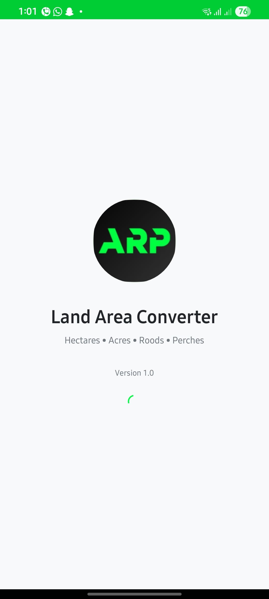
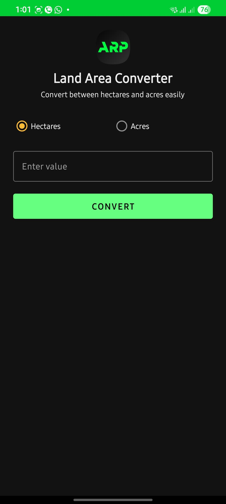
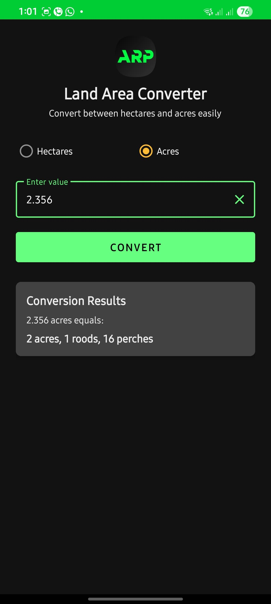
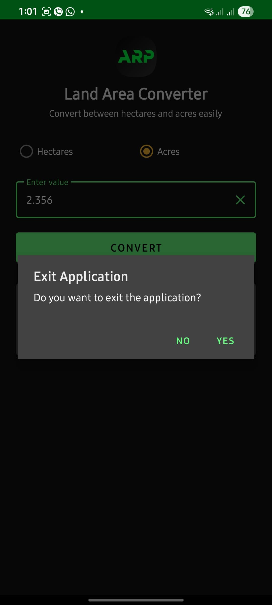

# 🌍 Land Area Converter

**Land Area Converter** is a simple, minimal, and user-friendly Android app that converts land area measurements both **Hectares** and **Acres** into **Acres**, **Roods**, and **Perches**.

---

## 🚀 Features

- 🔁 Convert both **Hectares** and **Acres**
- 📐 Get values in **Acres, Roods, and Perches**
- 🎯 Simple and accurate results
- 🌿 Smooth splash screen and clean UI
- 🌗 Both dark and light mode support
- 🔒 Fully offline – works without internet

---

## 📱 Screenshots

| Splash Screen | Conversion UI | Result Display | Exit |
|---------------|----------------|----------------|----------------|
|  |  |  |  |


---

## 📦 APK Download

⬇️ [Download Latest APK](https://github.com/dinethsadee01/ARP---Land-Area-Converter/releases/download/v1.0/ARP.apk)

> Current Version: **v1.0**

---

## 📄 Changelog

### v1.0 - Initial Release
- Initial stable version
- Hectare/acre input supported
- Converts to acres, roods, and perches
- Basic input validation
- Polished UI with Material Design
- Splash screen and light theme

---

## 🛠 Tech Stack

- 🧠 Language: Kotlin
- 🏗 Framework: Android SDK (API 21+)
- 🎨 UI: Material Components
- 📁 Architecture: Simple single-activity layout

---

## 🔧 Configuration
Before building or running the project, create a gradle.properties file by copying the example provided:

```bash
cp gradle.properties.example gradle.properties
```
Then, fill in the required keystore and signing details:

```bash
KEYSTORE_FILE=your_release_key.jks
KEYSTORE_PASSWORD=your_keystore_password
KEY_ALIAS=your_key_alias
KEY_PASSWORD=your_key_password
```
⚠️ Important: Never commit your gradle.properties file or any sensitive credentials to version control.

---

## 📂 Project Structure

```bash
├── app/
│   ├── src/
│   │   ├── main/
│   │   │   ├── java/com/landconverter/
│   │   │   │   ├── SplashActivity.kt
│   │   │   │   ├── MainActivity.kt
│   │   │   ├── res/
│   │   │   │   ├── layout/
│   │   │   │   ├── drawable/
│   │   │   │   ├── values/
│   │   └── ...
```

---

## 🤝 Contributing
Pull requests are welcome!
If you find any bugs or have feature suggestions, feel free to open an issue.

---

## 📜 License
This project is licensed under the MIT License.
See the [LICENSE](https://github.com/dinethsadee01/ARP---Land-Area-Converter/blob/master/LICENSE) file for details.

---

## 👨‍💻 Author
Made with ❤️ by [Dineth Sadeepa](https://github.com/dinethsadee01/)
